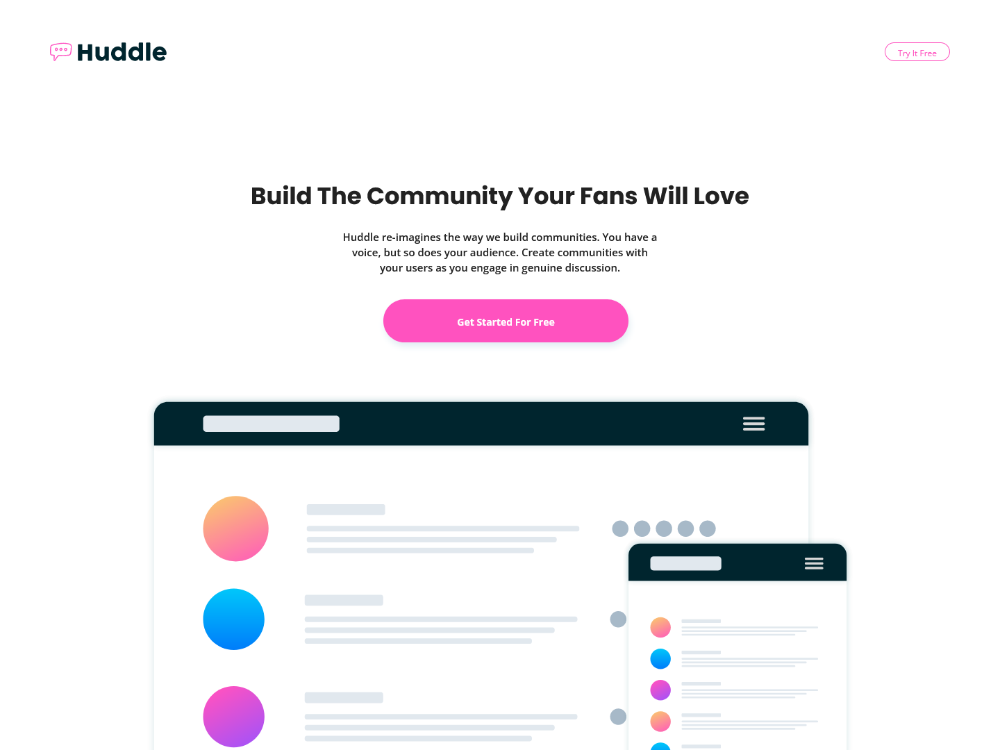

# Frontend Mentor - Huddle landing page with curved sections solution

This is a solution to the [Huddle landing page with curved sections challenge on Frontend Mentor](https://www.frontendmentor.io/challenges/huddle-landing-page-with-curved-sections-5ca5ecd01e82137ec91a50f2). Frontend Mentor challenges help you improve your coding skills by building realistic projects. 

## Table of contents

- [Overview](#overview)
  - [The challenge](#the-challenge)
  - [Screenshot](#screenshot)
  - [Links](#links)
- [My process](#my-process)
  - [Built with](#built-with)
  - [What I learned](#what-i-learned)
  - [Continued development](#continued-development)
  - [Useful resources](#useful-resources)
- [Author](#author)
- [Acknowledgments](#acknowledgments)

**Note: Delete this note and update the table of contents based on what sections you keep.**

## Overview

### The challenge

Users should be able to:

- View the optimal layout for the site depending on their device's screen size
- See hover states for all interactive elements on the page

### Screenshot

### Links

- Solution URL: [Add solution URL here](https://your-solution-url.com)
- Live Site URL: [Add live site URL here](https://your-live-site-url.com)

## My process

### Built with

- Semantic HTML5 markup
- CSS custom properties
- Flexbox
- CSS Grid
- Mobile-first workflow

### What I learned

I learned how to resize fontawesome icons, how to fill the white space beneath the footer, and how to style forms.

### Useful resources

- [w3schools](https://www.w3schools.com/css/css_form.asp) - This helped to show me how to style forms and change width and height.
- [FontAwesome](https://fontawesome.com/docs/web/style/size) - This article by FontAwesome themselves helped to explain how to resize their icons.
- [generatepress.com](https://generatepress.com/forums/topic/fill-footer-color-to-bottom-of-page/) - This forum gave a good tip on how to fill the white space I had beneath the footer in mobile view where the body background color was showing through.

## Author

- Frontend Mentor - [@laceeder](https://www.frontendmentor.io/profile/laceeder)
- Github - [@laceeder](https://www.github.com/laceeder)